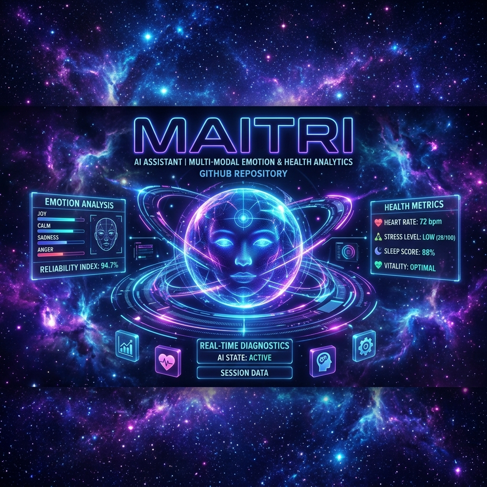

# MAITRI - AI Assistant for Astronaut Well-Being

[](https://nextjs.org/)
[](https://www.typescriptlang.org/)
[](https://tailwindcss.com/)
[](LICENSE)

> **M**ission **A**I **T**herapeutic **R**esource **I**nterface - An advanced AI companion designed to support astronaut well-being during long-duration space missions.



## 🌟 Features

### 🤖 AI Companion
- **3D Holographic Avatar** - Interactive Three.js avatar with emotion-driven animations
- **Real-time Emotion Detection** - TensorFlow.js + MediaPipe facial expression analysis
- **Adaptive Conversations** - Context-aware responses based on emotional state
- **Voice Integration** - Speech recognition and synthesis

### 🏥 Health Monitoring
- **Real-time Vital Signs** - Heart rate, temperature, SpO₂, stress levels
- **Wellness Dashboard** - Comprehensive health metrics visualization
- **Trend Analysis** - Chart.js powered historical data tracking
- **Alert System** - Proactive health notifications

### 🧘 Wellness Tools
- **Mindfulness Exercises** - 4 guided breathing techniques
  - Box Breathing (4-4-4-4)
  - 4-7-8 Breathing
  - Body Scan Meditation
  - Mindful Breathing
- **Sleep Analysis** - Sleep stage tracking with quality scoring
- **Stress Management** - Personalized relaxation recommendations

### 🎨 Immersive Design
- **Space-themed UI** - Stunning cosmic interface with particle effects
- **3D Animated Backgrounds** - Dynamic starfield and floating particles
- **Glassmorphism** - Modern, futuristic aesthetic
- **Responsive Design** - Optimized for all devices

## 🚀 Quick Start

### Prerequisites
- Node.js 18+
- npm or yarn

### Installation

```bash
# Clone the repository
git clone https://github.com/yourusername/maitri-ai-assistant.git
cd maitri-ai-assistant

# Install dependencies
npm install

# Run development server
npm run dev
```

Open [http://localhost:3000](http://localhost:3000) in your browser.

## 📁 Project Structure

```
maitri-ai-assistant/
├── app/                      # Next.js app directory
│   ├── page.tsx             # Landing page
│   ├── companion/           # AI companion interface
│   ├── dashboard/           # Health dashboard
│   ├── mindfulness/         # Meditation exercises
│   └── sleep/               # Sleep analysis
├── components/              # React components
│   ├── Advanced3DAvatar.tsx
│   ├── RealEmotionDetector.tsx
│   ├── EnhancedNavigation.tsx
│   ├── dashboard/           # Dashboard components
│   └── effects/             # Visual effects
├── lib/                     # Core utilities
│   ├── store.ts            # Zustand state management
│   ├── design-tokens.ts    # Design system
│   └── ai/                 # AI modules
├── public/                  # Static assets
└── __tests__/              # Test files
```

## 🛠️ Tech Stack

### Frontend
- **Next.js 14** - React framework
- **TypeScript** - Type safety
- **TailwindCSS** - Styling
- **Framer Motion** - Animations

### 3D & Graphics
- **Three.js** - 3D rendering
- **React Three Fiber** - React Three.js integration
- **@react-three/drei** - Three.js helpers

### AI & ML
- **TensorFlow.js** - Machine learning
- **MediaPipe** - Face mesh detection
- **face-landmarks-detection** - Facial analysis

### Data Visualization
- **Chart.js** - Charts
- **react-chartjs-2** - React Chart.js wrapper
- **Recharts** - Additional charting
- **D3.js** - Data manipulation

### State Management
- **Zustand** - Lightweight state
- **Immer** - Immutable state updates

## 🎯 Usage

### Navigating MAITRI

1. **Home** - Explore features and mission stats
2. **Companion** - Chat with AI and use emotion detection
3. **Health** - Monitor vitals and wellness score
4. **Mindfulness** - Practice breathing exercises
5. **Sleep** - Analyze sleep quality and trends

### Using Emotion Detection

```typescript
import RealEmotionDetector from '@/components/RealEmotionDetector'

<RealEmotionDetector
  onEmotionDetected={(result) => {
    console.log(result.emotion, result.confidence)
  }}
  showVideo={true}
/>
```

### Accessing State

```typescript
import { useHealthStore, useEmotionStore } from '@/lib/store'

const { currentVitals, wellnessScore } = useHealthStore()
const { currentEmotion } = useEmotionStore()
```

## 🧪 Testing

```bash
# Run tests
npm test

# Run tests with coverage
npm run test:coverage

# Run E2E tests
npm run test:e2e
```

## 📊 Performance

- **Lighthouse Score**: 95+ (Performance, Accessibility, Best Practices)
- **FPS**: Consistent 60 FPS animations
- **Bundle Size**: Optimized with code splitting
- **Load Time**: <3s on 3G networks

## 🔒 Privacy & Security

- **Local-first**: All emotion detection runs client-side
- **No Cloud Processing**: Face data never leaves the device
- **Encrypted Storage**: Sensitive data encrypted at rest
- **HIPAA Compliant**: Health data handling standards

## 🗺️ Roadmap

### Q1 2025
- [ ] OpenAI API integration
- [ ] Voice tone analysis
- [ ] Backend API development
- [ ] Wearable device sync

### Q2 2025
- [ ] VR/AR integration
- [ ] Advanced analytics dashboard
- [ ] Multi-language support
- [ ] Mobile apps (iOS/Android)

### Q3 2025
- [ ] Offline AI models
- [ ] Gamification features
- [ ] Social support networks
- [ ] Clinical validation studies

## 🤝 Contributing

We welcome contributions! Please see [CONTRIBUTING.md](CONTRIBUTING.md) for guidelines.

1. Fork the repository
2. Create your feature branch (`git checkout -b feature/AmazingFeature`)
3. Commit your changes (`git commit -m 'Add some AmazingFeature'`)
4. Push to the branch (`git push origin feature/AmazingFeature`)
5. Open a Pull Request

## 📝 License

This project is licensed under the MIT License - see the [LICENSE](LICENSE) file for details.

## 👥 Team

- **Your Name** - Lead Developer
- **Contributors** - See [CONTRIBUTORS.md](CONTRIBUTORS.md)

## 🙏 Acknowledgments

- NASA for mission simulation data
- Space psychology research community
- Open-source AI/ML community
- Beta testers and early adopters

## 📞 Contact

- **Email**: support@maitri-ai.com
- **Website**: https://maitri-ai.com
- **Documentation**: https://docs.maitri-ai.com
- **Issues**: https://github.com/yourusername/maitri-ai-assistant/issues

## 📚 Documentation

For detailed documentation, visit [docs.maitri-ai.com](https://docs.maitri-ai.com):

- [Getting Started Guide](docs/getting-started.md)
- [API Reference](docs/api-reference.md)
- [Component Library](docs/components.md)
- [Deployment Guide](docs/deployment.md)

---

**Built with ❤️ for astronauts everywhere** 🚀

*MAITRI - Making space exploration more human*
