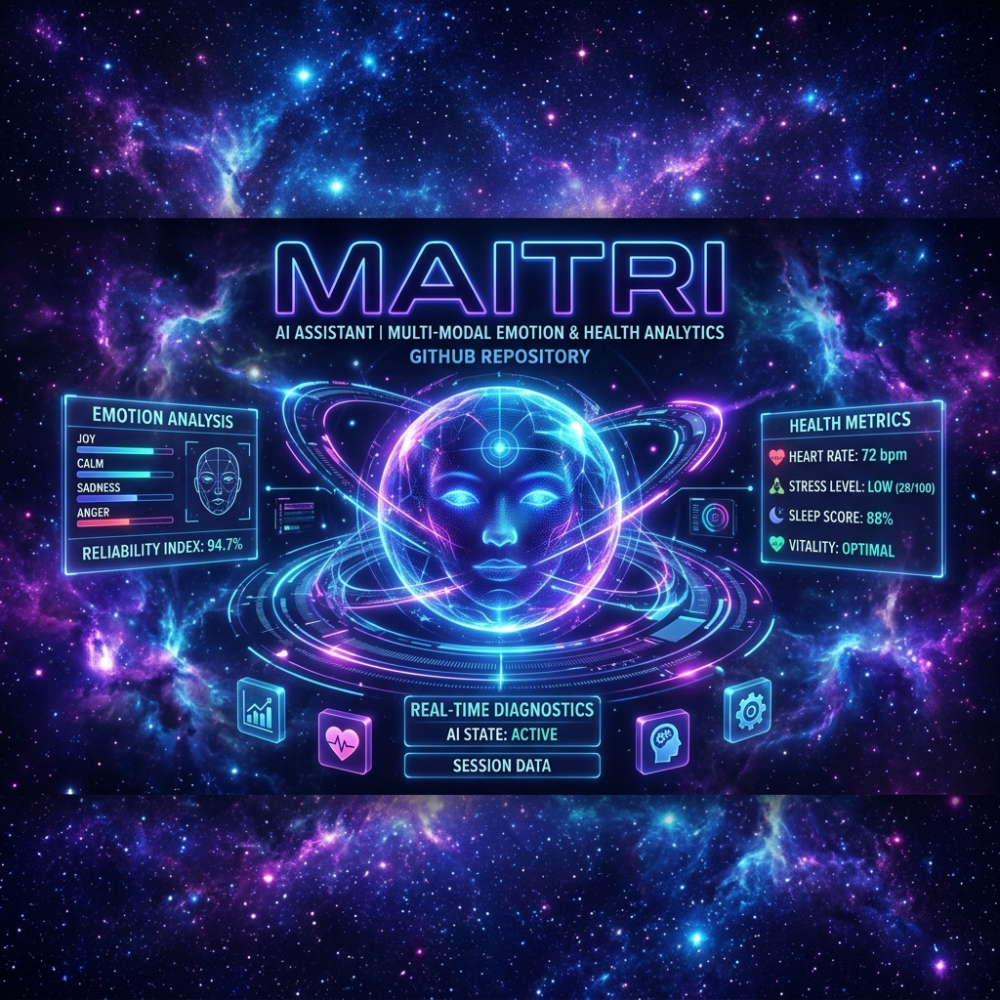
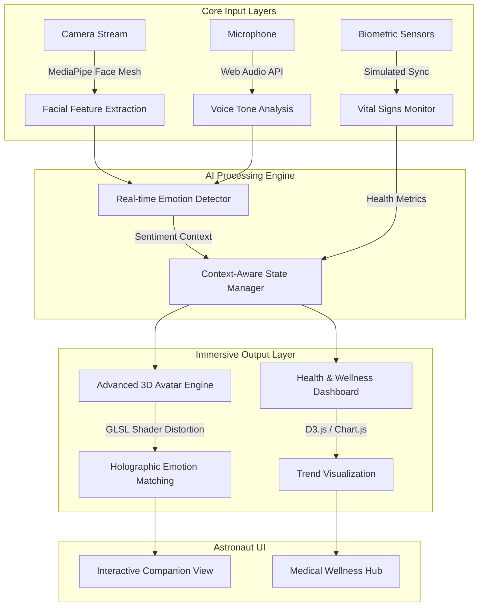

# MAITRI - Mission AI Therapeutic Resource Interface

<div align="center">
  
  <p align="center">
    <strong>Your AI Companion in the Cosmos: Advanced Multimodal Support for Astronaut Well-Being</strong>
  </p>
  
  [](https://nextjs.org/)
  [](https://www.typescriptlang.org/)
  [](https://tailwindcss.com/)
  [](https://threejs.org/)
  [](https://www.tensorflow.org/js)
</div>

---

## 🚀 Project Overview

**MAITRI** is an advanced AI-powered assistant designed specifically for the unique psychological and physical challenges of long-duration space missions. By combining real-time emotion detection, immersive 3D visualization, and comprehensive health monitoring, MAITRI serves as a vital therapeutic resource for crew members navigating the isolation of deep space.

### 🌌 The Mission
To bridge the gap between human emotion and machine intelligence, ensuring that space exploration remains a human-centric journey through proactive mental health support and biometric analysis.

---

## 🧠 Architecture Diagram

The MAITRI ecosystem is built on a high-performance, multimodal data pipeline that processes environmental and human signals entirely on the client side to ensure mission reliability and privacy.


```mermaid
graph TD
    subgraph "Core Input Layers"
        A[Camera Stream] -->|MediaPipe Face Mesh| B[Facial Feature Extraction]
        C[Microphone] -->|Web Audio API| D[Voice Tone Analysis]
        E[Biometric Sensors] -->|Simulated Sync| F[Vital Signs Monitor]
    end

    subgraph "AI Processing Engine"
        B --> G[Real-time Emotion Detector]
        D --> G
        G -->|Sentiment Context| H[Context-Aware State Manager]
        F -->|Health Metrics| H
    end

    subgraph "Immersive Output Layer"
        H --> I[Advanced 3D Avatar Engine]
        H --> J[Health & Wellness Dashboard]
        I -->|GLSL Shader Distortion| K[Holographic Emotion Matching]
        J -->|D3.js / Chart.js| L[Trend Visualization]
    end

    subgraph "Astronaut UI"
        K --> M[Interactive Companion View]
        L --> N[Medical Wellness Hub]
    end
```

---

## ⚙️ Tech Stack

### **Frontend & UI Architecture**
*   **Next.js 14**: Server-side rendering and optimized routing.
*   **TypeScript**: Robust type safety for mission-critical logic.
*   **Tailwind CSS**: Modern, utility-first styling with Glassmorphic effects.
*   **Framer Motion**: Smooth, cinematic UI transitions and micro-animations.

### **AI & Machine Learning**
*   **TensorFlow.js**: High-performance neural network execution in the browser.
*   **MediaPipe**: Real-time 468-point face mesh tracking.
*   **Sentiment Analysis**: Custom logic for mapping facial action units to emotional states.

### **3D Rendering & Graphics**
*   **Three.js**: Industry-standard 3D engine for web.
*   **React Three Fiber**: Declarative interface for Three.js.
*   **Custom Shaders**: GLSL-based distortion and particle effects for the holographic persona.

### **State & Performance**
*   **Zustand**: Lightweight, persistent global state management.
*   **Immer**: Immutable state updates for predictable data flow.
*   **Web Workers**: Off-main-thread processing for intensive AI tasks.

---

## 🎯 Elite Features

### 🤖 3D Holographic Companion
Experience a truly responsive AI partner. The companion's holographic form reacts physically to your emotional state—changing its color, distortion patterns, and particle field density to mirror or soothe your mood.

### 🎭 Real-time Emotion Intelligence
Powered by MediaPipe, MAITRI analyzes subtle facial movements and voice modulations to detect happiness, stress, fatigue, or sadness. This allows the AI to adjust its tone and guidance in real-time.

### 🏥 Health & Vitality Hub
A comprehensive cockpit for your wellness. Track heart rate, oxygen levels, and stress scores with high-fidelity visualizations. Predictive alerts nudge you toward rest or mindfulness before burnout occurs.

### 🧘 Cosmic Mindfulness Tools
Guided breathing and meditation modules designed for low-gravity environments. Featuring 4-7-8 breathing, box breathing, and body scan techniques with immersive spatial audio.

---

## 🔥 Unique Innovations

1.  **Zero-Latency Privacy Architecture**: Unlike consumer AI assistants, MAITRI process all data locally. Critical for missions where light-speed lag makes cloud processing impossible and privacy is paramount.
2.  **Holographic Emotion Mapping**: A first-of-its-kind visual feedback loop where the AI's physical representation is intrinsically tied to the user's emotional data via custom shaders.
3.  **Adaptive Support Ecosystem**: The system doesn't just monitor; it adjusts its interface (brightness, colors, response length) based on the astronaut's detected stress and circadian rhythm.

---

## 🚀 Getting Started

### Prerequisites
- Node.js 18.x or higher
- Modern browser with WebGL 2.0 support
- Webcam for emotion detection

### Installation
```bash
git clone https://github.com/bansal1806/maitri-ai-assistant.git
cd maitri-ai-assistant
npm install
npm run dev
```

---

## 🌐 Live Demo
Experience the future of astronaut support: [maitri-ai.vercel.app](https://maitri-ai.vercel.app) *(Coming Soon)*

---

**Built with ❤️ for the next generation of explorers.** 🚀
